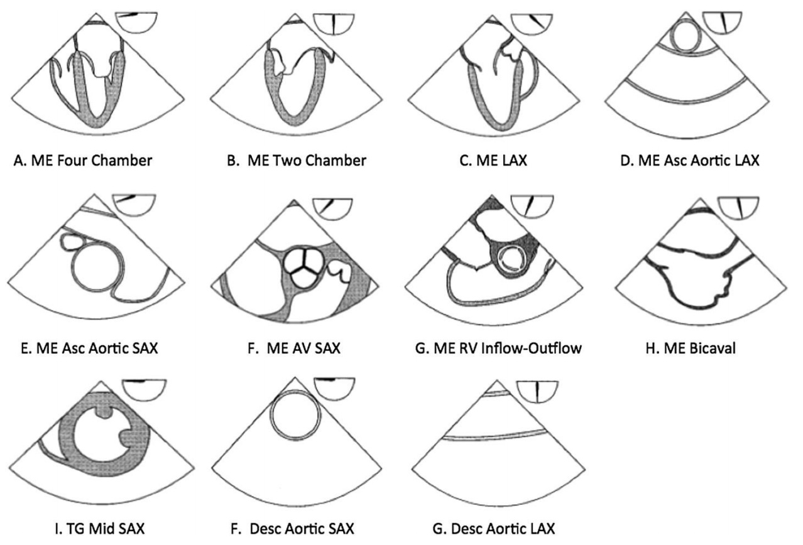

## ASE TEE Guidelines
- [TEE in Surgical Decision Making 2020](https://www.asecho.org/wp-content/uploads/2020/06/TEE-Surgical-Decision-Making_June2020.pdf)
- [Evaluation of Prosthetic Valves 2009](https://www.onlinejase.com/article/S0894-7317(09)00676-2/pdf)
- [Right Ventricular Assessment 2010](https://www.onlinejase.com/article/S0894-7317(10)00434-7/pdf)
- [Valvular Regurgitation 2017](https://www.asecho.org/wp-content/uploads/2017/04/2017VavularRegurgitationGuideline.pdf)
- [Post TAVR/Mitraclip 2019](https://www.asecho.org/wp-content/uploads/2019/04/Percutaneous-VR_2019.pdf)

## TEE education
- [Univ Toronto Virtual TEE](http://pie.med.utoronto.ca/tee/)
- [Univ Utah TEE Videos](https://echo.anesthesia.med.utah.edu/tee/)
- [echocardiographer.org](https://echocardiographer.org/)

## WashU Internal Protocols 
(requires wustl-key)
- [POD3 CT Protocols](https://collaboration.wustl.edu/depts/anest/Anesthesiology/BJHClinicalAreas/POD3CT/default.aspx)
- [WashU Internal TEE Site](https://sites.wustl.edu/teeresources/)
- [BJH lab test catalogue](https://bjhlab.testcatalog.org/)

## [Double Lumen Tube Sizing Guide](/resources/dlt_sizing)

## Basic TEE Views

